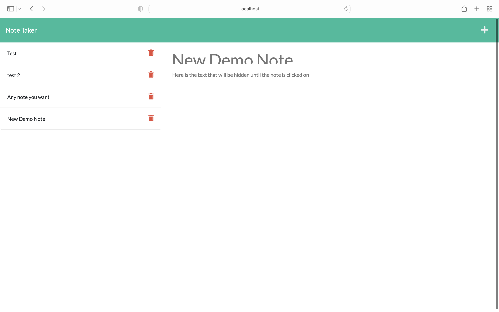

# Take-Note

## Description
This is a command line app that allows you to start a server and input notes that will be saved to the server.

## Screenshot

## [Video Link](https://drive.google.com/file/d/1ci16OMsR86jvkL8WhDEMlz3HVhdECgPm/view?usp=sharing)

## Install
To install my app clone the repo then navigate to where you want it to be cloned through your terminal. from there run 'git clone "the cloned url here"'. then open the app in vs code and run 'npm i' in the terminal. from here go to your browser and open http://localhost3001/ where you will be introduced to the main page.